## 安装 git


打开软件安装包, 不断Next, 直到出现下一步所示的界面.

> 安装路径根据实际情况选择


不希望系统的环境变量被污染, 可以选择第一项. 如果想把 git 添加到环境变量, 可选择第二项(默认). 不建议选择第三项.  接着不断Next, 直到出现下一步所示界面.


点击 Install 进行安装, 等待完成.


在任意地方右键打开 git-bash, 执行以下命令对 git 进行配置, 以及查看配置结果.

```
git config --global user.name "姓名"
git config --global user.email 邮箱
git config --global --list
```

> 这些是 git 的基础配置, 不配置则 git 无法使用

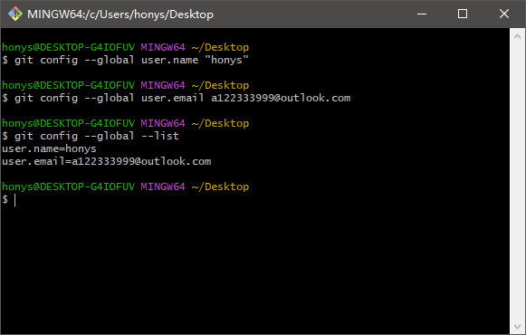


## 配置 git 和 github


打开如下界面, 创建 token.

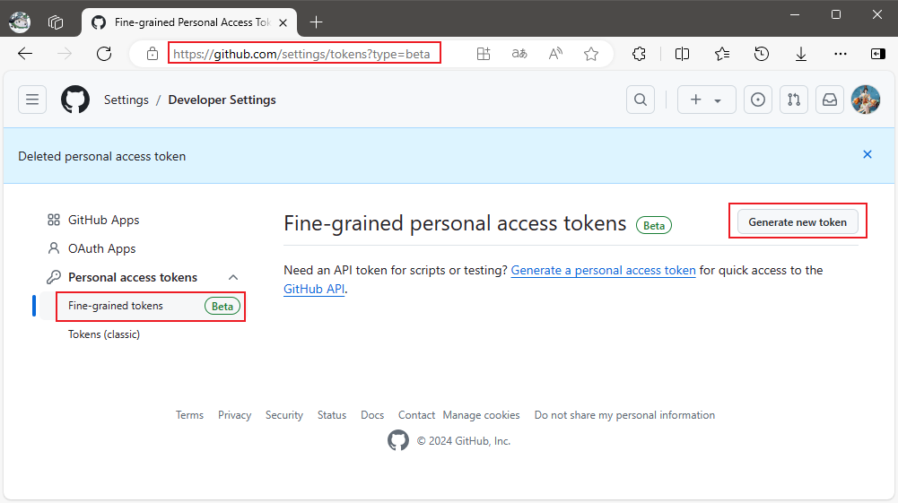


输入名称(随意) 和 token 的有效期.

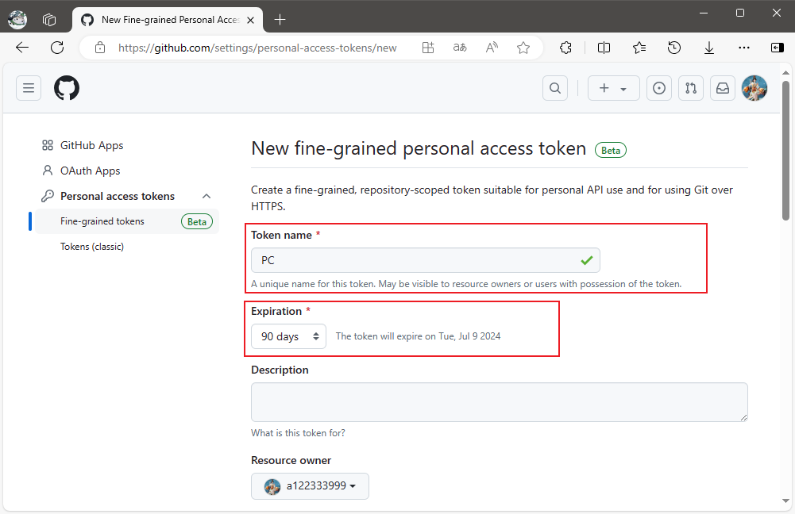


根据个人喜好选择第二项或者第三项, 不能第一项.

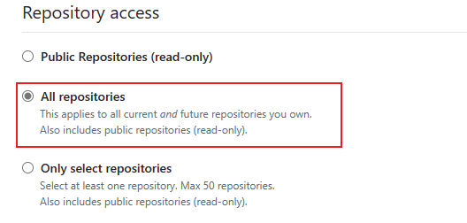


展开存储库权限, 把 Contents 设置为可读写.

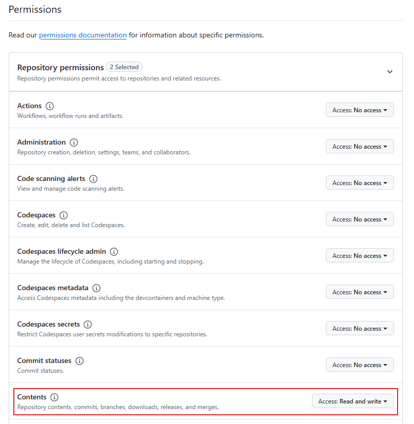


点击创建 token.

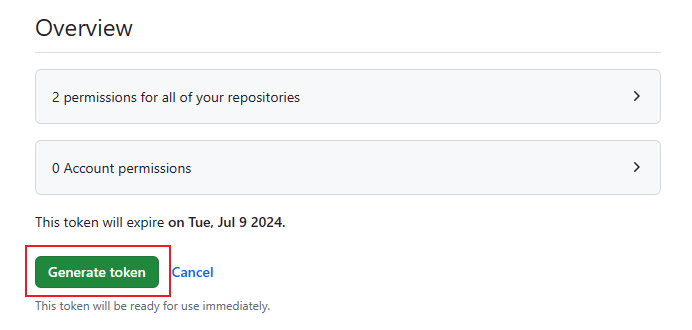


复制 token 备用, 如果关闭该界面则 token 再也无法看到, 需重新创建.  (注意 token 不要泄露)

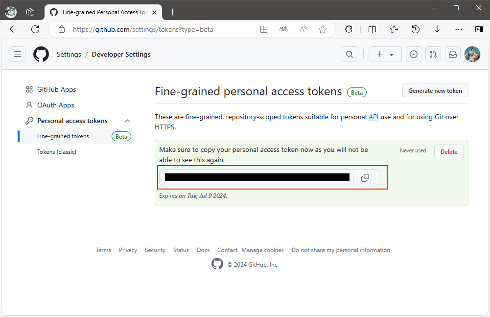


## 使用 git 和 github


再 github 上创建一个项目, 然后复制项目路径.

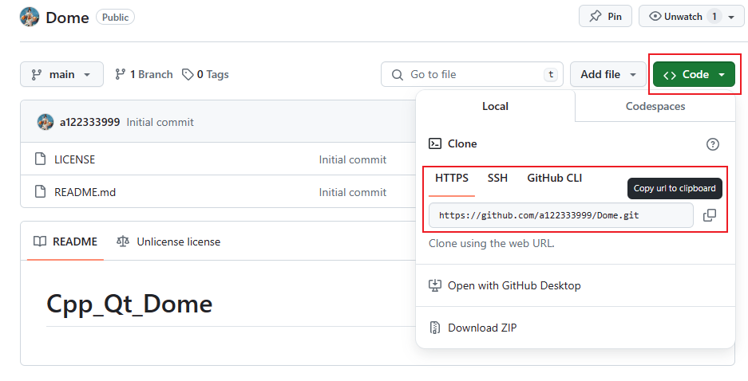


在需要本地存放项目的路径打开 git-base, 执行克隆命令.

```sh
git clone 项目路径
```

> 克隆失败可能是科学上网的问题

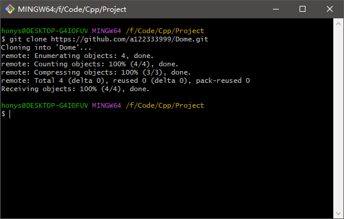


随便修改点项目的什么东西, 然后在项目目录中打开 git-bash, 执行添加缓存和提交.

```
git add .
git commit -m "描述"
```

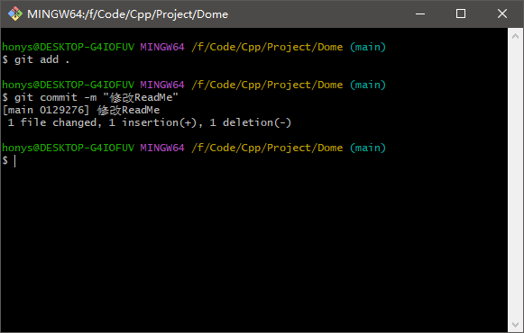


执行推送命令把新提交推到 github.

```
git push 仓库地址 分支名
```

> origin 默认等价于你所克隆的远程仓库.  推送之前可以拉取一下以合并新内容(如果有), 避免推送失败.

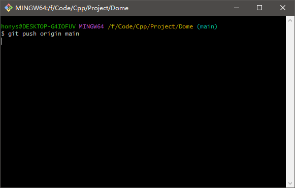


此时会弹出验证窗口, 把之前创建的 token 粘贴上去即可, 首次需要粘贴, 后续无需重复此步骤.

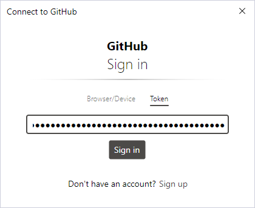


推送成功.

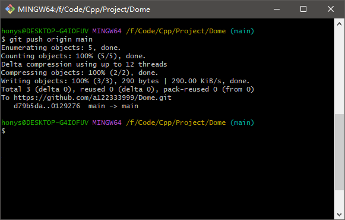


## 错误问题


通常连接失败是因为没有科学上网, 如果科学上网了还是连接失败, 则可能是 git 使用的代理端口和实际的代理端口不一致, 此时只需要把 git 的代理端口号配置为实际端口号即可.

```sh
git config --global http.proxy 127.0.0.1:端口号
git config --global https.proxy 127.0.0.1:端口号
git config --global --list
```

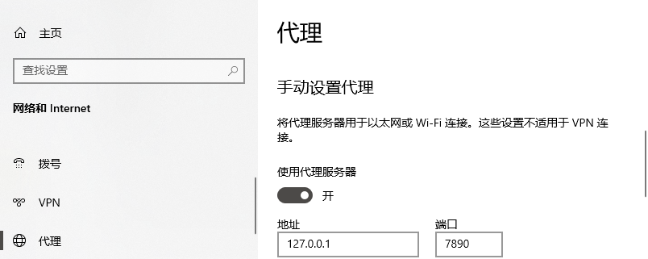

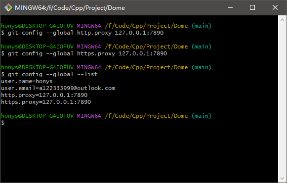